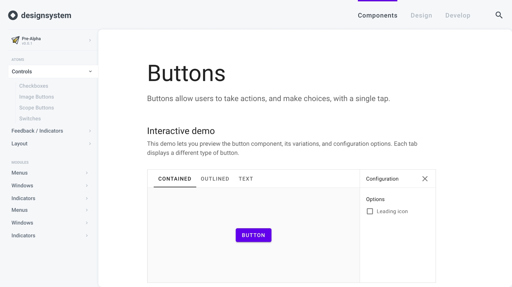

# Design system

A modern setup to collaborate between researcher, designer, developer and team leader  🎉

## I asked 20 people about design systems

[Design System Survey](http://bit.ly/2BAJBeH)

### They work full-time as

* **5:** UX Designers
* **5:** UI Designers
* **7:** Developers
* **3:** Team leaders

### Their company size

* **0%:** 1 to 5
* **31%:** 5 to 50
* **38%:** 50 to 500
* **31%:** more than 500

### Does their company use such systems?

* **100%:** yes

### Who decided about using such systems?

* **80%:** Team
* **15%:** Team leader
* **5%:** Other

## Evaluation 

The list elements are sorted by priority

### People want to

* **maintain** their shit in the most simple way
* **reduce** communication efforts
* **reduce** maintenance efforts
* **collaborate** within different teams
* **deliver** consistent interfaces
* **deliver** consistent guidelines and specifications
* **deliver** consistent code
* **deliver** releases
* **share** thoughts on decisions
* **automate** component updates
* **automate** guideline updates
* **automate** specification updates
* **automate** code updates

### Gains

* **Faster** implementation of projects 
* **Reduced** communication efforts
* **Focus** on collaboration
* **Consistency** of code and design
* **Scalability** through modularity
* **Code** Embedded examples *(research development requirements)*
* **Templates** Documentation Templates

### Pains

* Keeping the design system **up to date**
* High manual **effort**
* Lose **overview**

### Gain creators
* **Offer** Components, Guidelines and Specifications
* **Offer** Code
* **Offer** Releases / Branching Systems
* **Offer** Editor for designers to contribute
* **Offer** Repository integration for developers
* *Work in progress*

### Pain relievers
* **Reference** components
* **Automate** build process
* *Work in progress*

### Product/Service/Outcome

#### Highlevel

* *Work in progress*
* **Everybody:** use **Git or Github or Gitlab** to versioning and share
* **Designer:** check [Gitbook](https://www.gitbook.com/) to maintain content (sweet interface)
* **Designer:** check [Github Pages](https://pages.github.com/) to serve content (markdown to html via jekyll)
* **Designer:**: check Git Large File Storage [git-lfs](https://git-lfs.github.com/)
* **Developer:** check [Storybook](https://storybook.js.org/) to integrate documentation within your app repository
* **Everybody:** check [Github CI](https://github.com/marketplace/category/continuous-integration) 
  * to build your shit in an automated way (listen to push on master)
  * to serve a wrapper template around your repositories (design / dev)
  * to map and sync both repositories through componentID, variantID and versionID
* **Everybody**: check visual regression testing to maintain binaries (automated visual testing)
* **Everybody**: develop a solid repository structure. Mine would be an adapted atomic design pattern (styles, atoms, molecules, organisms, templates, flows)

#### Lowlevel

* *Work in progress*
* **Designer:** this could be an interface deployed via **Github CI / Github Pages** 

## Installation

* **Designer:** create a **Gitbook Account** and integrate your Github repository
* **Designer:** change **Github Setting**s to activate Github Pages
* *Work in progress*
